# Tutorial Instalar The Littlest-JupyterHub en un VPS

En este tuorial vamos a ver como instalar  The Littlest JupyterHub en un VPS las herramientas que utilizaremos seran:

* Distro de Ubuntu 20.04 LTS instalada en Windows con WSL. [Ver](https://learn.microsoft.com/es-es/windows/wsl/install). Como alternativa a esto puedes utilizar [Putty](https://www.hostinger.es/tutoriales/conectar-usando-terminal-putty-ssh/) desde Windows.

* Un VPS (Servidor Privado Virtual) contratado de Hostinger con las siguientes caracteristicas:

  * 1GB RAM
  * 20GB HDD
  * 2 nucleos

  **Estas caracteristicas son las minimas que provee hostinger para contratar un servicio de VPS.**
  **Una vez que contratamos el servicio de Hostinger este nos provee una IP publica con la cual vamos a poder conectarnos desde nuestro SO local por medio de una conexion ssh, si quieres contratar una puedes hacerlo desde [aqui](https://www.hostinger.com.ar/vps-argentina)**

* Algo de conocimiento con la consola de Linux. Si necesitas ayuda puedes verla desde [aqui](https://www.guru99.com/linux-commands-cheat-sheet.html)

## Pasos a Seguir para la instalacion

Podemos dividir la Instalacion de TLJH en estos Pasos:

1. Acceder al Sevidor de Forma Segura.
2. Instalar las Herramientas.
3. Apuntar el proyecto a nuestro Dominio.
4. Customizar nuestra version de TLJH.

## 1. Acceder al Servidor de Forma Segura

1. Vamos a abrir una terminal de Ubuntu corriendo en Windows con WSL y desde ahi ver la gestion de memoria de nuestra SO local corriendo el comando:

   `$ htop -s PERCENT_MEM`

2. Luego abriremos otra terminal desde donde vamos a conectarnos a nuestro VPS con el comando:

   `$ ssh <username>@<ip-address or hostname>`

* Donde `<username>` es el usuario con el que vamos a acceder a nuestro VPS. Esta por ser nuestra primera vez el `<username>` va a ser `root`.

* Donde `<ip-address or hostname>` sera la ip publica que nos asigno Hostinger para poder acceder a nuestra VPS.

* La primera vez que nos conectemos nos pedira contraseña, es la que escojiste a la hora de configurara tu VPS como se ve en la imagen.

   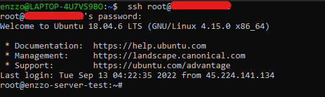

* Como podras ver la linea de comandos cambia a color blanco para diferenciarla de la de wsl.

3. Una vez dentro de tu VPS puedes actalizarlo con los siguientes comandos:

   * `$ sudo apt-get update`
   * `$ sudo apt-get upgrade`
   * `$ sudo reboot`

* Luego de esto necesitaras volver a acceder a tu VPS siguiendo el paso 2.

4. Ahora vamos a crear y copiar las claves de accesos ssh para acceder de esa forma a nuestro VPS.

* Abriremos una nueva terminal y desde esta vamos a correr el comando para poder generar la clave ssh y guardarla en nuestro ordenador:

   `$ ssh-keygen -t rsa`

   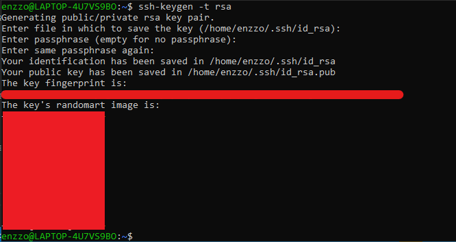

* Ahora deberemos ponerla en un formato para que podamos añadirla a nuestro VPS con el comando:

   `$ cat ~/.ssh/id_rsa.pub`

   

* Ahora solo copiaremos lo que nos entrego ese comando y lo pegaremos en el panel de gestion de claves ssh VPS de Hostinger.
* Primero haciendo click en el boton:

   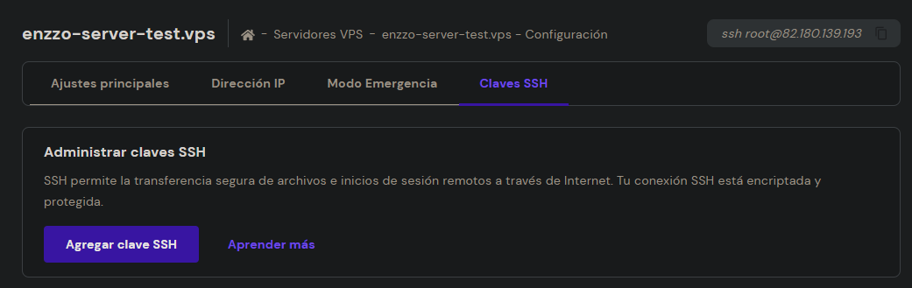

* Luego ponemos un nombre y pegamos el contenido que copiamos previamente.

   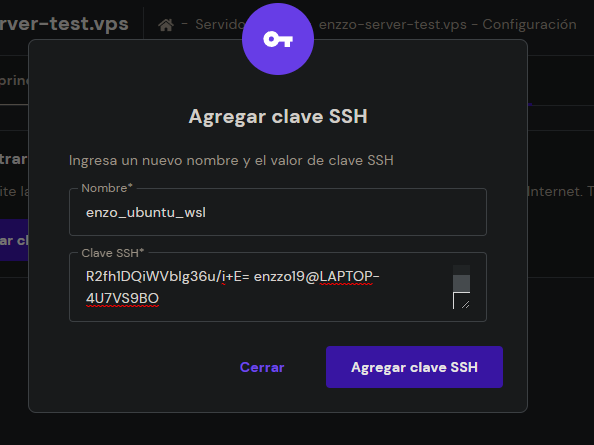

* Una vez agregada tu clave ssh ya no te va a pedir ingresar con contraseña, simplemente ingresara al correr el comando:

   `$ ssh <root>@<ip-address>`

5. Vamos a crear un usuario con permisos de administrador para luego restingir el acceso como root a nuestro VPS.

* Desde el usuario root de nuestro VPS vamos a correr el comando:

   `$ adduser <nombre_nuevo>`

   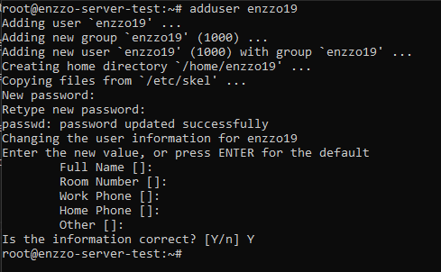

* Luego de correr el comando nos pedira colocar 2 veces la contraseña para este nuevo usuario que creamos.

* Nos pedira tambien un poco de informacion adicional, que pueden saltar simplemente dando en Enter.

* Vamos a salir de la consola del usuario root con el comando: `$ logout` y desde nuestro wsl continuaremos.

6. Vamos a copiar las claves de acceso ssh a este nuevo usuario corriendo el comando:

   `$ ssh-copy-id <tu_nombre_usuario_nuevo>@<tu_ip_server>`

   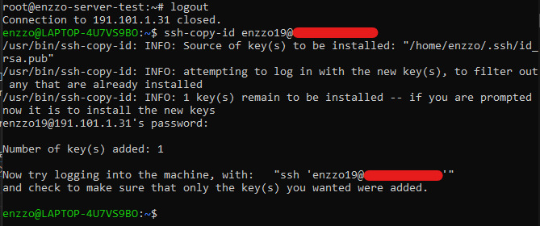

* Nos pedira la contraseña que elegimos para este nuevo usuario.

* Ahora podemos volver a conectarnos a nuestro usuario root para darle permiso de administrador a este nuevo usuario que acabamos de crear.

* Para eso desde el root de nuestro VPS vamos a correr el comando:

   `$ usermod <tu-nombre-usuario_nuevo> -G sudo`

* Para comprobar que este nuevo usuario tiene permisos de administrador puede probar el comando:
  
   `$ su <tu-nombre-usuario_nuevo>`

* Y luego dentro de este nuevo usuario corre el comando:

   `$ sudo ls /`

* Solo deberia pedir la contraseña de este nuevo usuario y mostrar la estructura de directorios.

   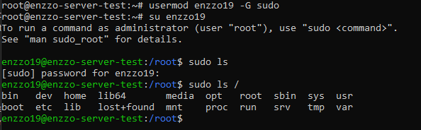

* Salir de ese superusuario y regresar a root: `$ exit`

7. Ahora vamos a bloquear el acceso root y el acceso por contraseña a nuestro VPS. Quizas necesites [Tutorial de VIM](https://victorhckinthefreeworld.com/2017/06/14/como-salir-del-editor-vim/)

* Desde el usuario root vamos a buscar el archivo para editar los permisos con el comando:

   `$ vim /etc/ssh/sshd_config`

* Y aqui especificamente buscaremos las opciones:
  * Para no permitir el acceso root:
    * `PermitRootLoogin <no>` (cambiar)
  * Para no permitir el acceso por contraseña
    * `PasswordAuthetication <no>` (cambiar)

* Desde Vim para:
  * Entrar en modo edicion presionamos `i`
  * Guardar un cambio `:w`
  * Salir del editor `:q`

* Para guardar los cambios en el sistema:

   `$ systemctl restart ssh`

* Para salir del usuario root:

   `$ logout`

* En este punto no deberias poder acceder como usuario root ni tampoco acceder a otro usuario con contraseña  a tu sevidor como se ve en la imagen.

   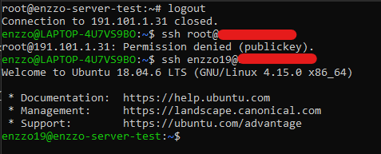

* Entonces ya dejamos un VPS con las configuraciones MINIMAS de seguridad y vamos a acceder a travez del comando:

   `$ ssh <tu_nombre_usuario_nuevo>@<tu_ip_server>`

## 2. Instalar las Herramientas

* Ahora que nuestro VPS tiene las configuraciones MINIMAS de seguridad vamos a empezar a instalar ahora si The Littlest Jupyter Hub dentro de el.

1. Primero en tu navegador vas a copiar la direccion IP de tu VPS y ver el contenido que esta te entrega:

* Aqui pueden pasar 2 cosas:

   * El puerto esta liberado y la pagina no tiene ningun contenido, ni siquiera accede (Esto seria bueno y te llevaria directamente al paso 2).

   * El puerto esta ocupado con un proceso y se debe matar el proceso antes de continuar.

* Desde Hostinger sucede lo segundo ya que si colocamos la direccion ip en nuestro navegador obtenemos:

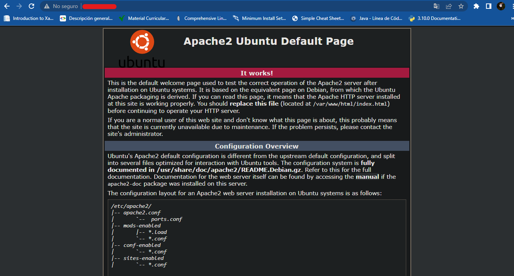

* Entonces vamos a encontrar y matar el proceso para liberar el puerto que necesitamos

* Primero vamos a listar los puertos con el comando:

   `$ sudo netstat -tupln`
  
   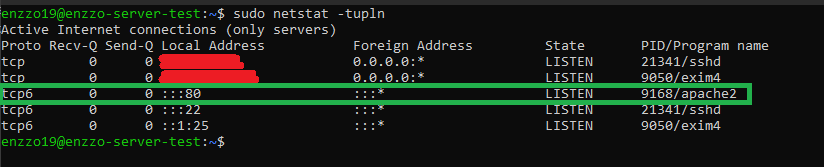

* Aqui buscar el puerto 80 y el numero de PID que tiene luego matarlo con el comando:

   `$ sudo kill -<numero-PID-proceso> PID`

* Ahora una vez que matamos el proceso corriendo en ese puerto al acceder a la ip desde nuestro navegador deberiamos ver algo como:
  
   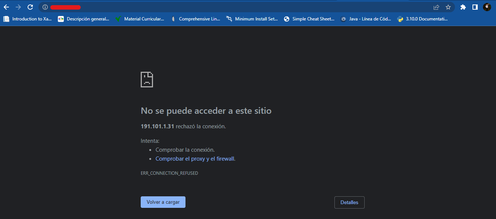

* Y asi exactamente es como la necesitabamos.

1. Probar de levantar un servidor

* Si estas en este punto puede probar de crear un archivo con:
  
   `$ touch HOLA`

   `$ ls`

* Intenta levantar un servidor con python en el puerto 80 (puerto por defecto para protocolo http):
  
   `$ sudo python3 - m http.server 80`

   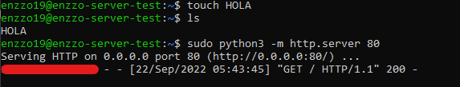

* Una vez realizados estos pasos podemos volver a acceder a nuestra ip desde el navegador y veremos algo como:

   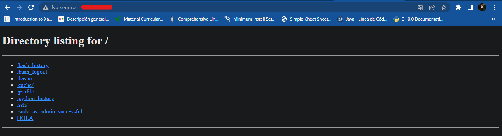

* Para detenerlo simplemente apretar la convinacion de teclas `CTRL + C` en la consola donde se estaba corriendo.

3. Ahora vamos a instalar TLJH siguiendo la [guia](https://tljh.jupyter.org/en/latest/install/custom-server.html)

* Asegúrese de tener `python3` y `python3-dev` instalados tambien `curl` `git` para eso vamos a correr el comando:

   `$ sudo apt install python3 python3-dev git curl`

   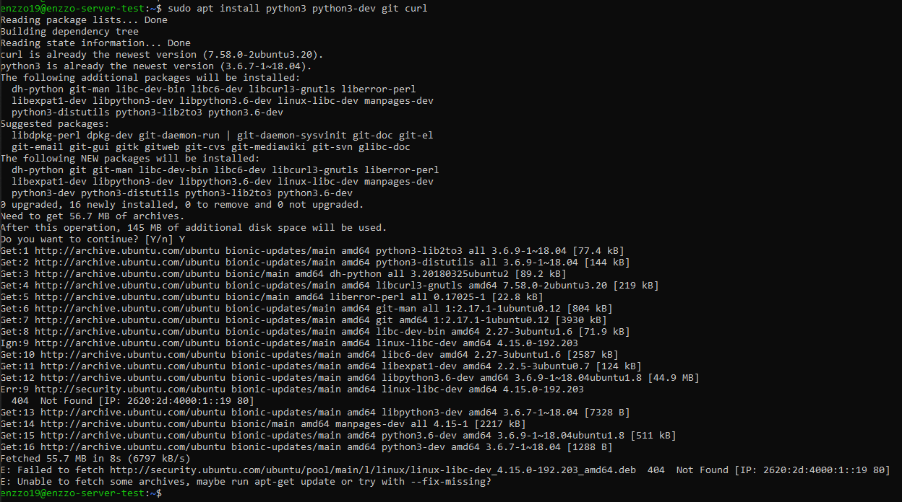

* Copie el texto a continuación y péguelo en la terminal. Reemplace `<admin-user-name>` con el nombre del primer usuario administrador de este JupyterHub. Elija el nombre que desee (¡no olvide quitar los corchetes!).

   `$ curl -L https://tljh.jupyter.org/bootstrap.py | sudo -E python3 - --admin <admin-user-name>`

* Este usuario administrador puede iniciar sesión después de Instalar TLJH y puede configurarlo según sus necesidades.

* ¡Recuerda agregar tu nombre de usuario !

* Esto puede tardar un poco dependiendo de tu conexion de red.

   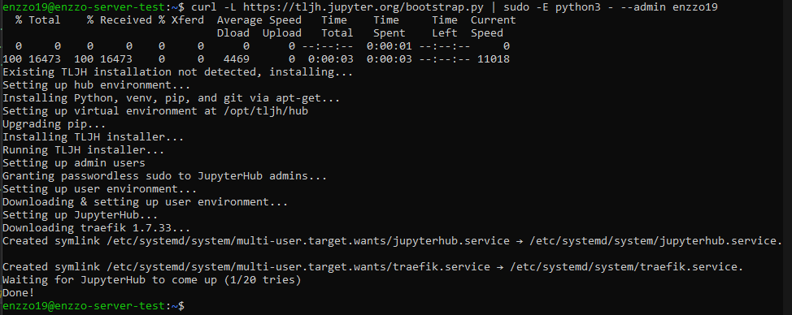

* Copie la IP pública de su servidor e intente acceder `http://<public-ip>` desde su navegador. Si todo salió bien, esto debería darle una página de inicio de sesión de JupyterHub.

   

* Inicie sesión con el nombre de usuario administrador que utilizó en el paso anterior. Puede elegir cualquier contraseña que desee. Use una contraseña segura y anótela en algún lugar, ya que esta será la contraseña para la cuenta de usuario administrador a partir de ahora.

* ¡Felicitaciones, tiene un JupyterHub en funcionamiento!

## 3. Habilitar HTTPS y apuntar a nuestro Dominio

1. Primero Vamos a conseguir un dominio para apuntarlo a nuestro servidor, esto tambien lo puden hacer desde Hostinger desde [aqui](https://www.hostinger.com.ar/registrar-dominio).

   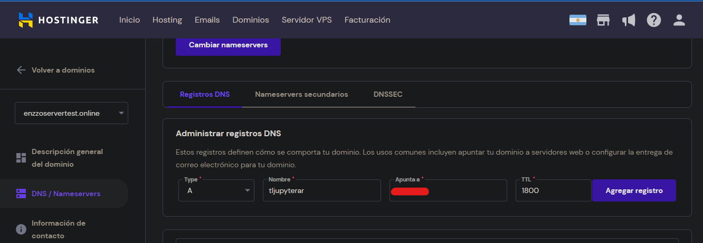

* Donde esta tapado por rojo va nuestra direccion ip.

2. Ahora siguiendo el [tutorial](https://tljh.jupyter.org/en/latest/howto/admin/https.html#howto-admin-https) vamos a habilitar HTTPS y apuntar tljh a nuestro dominio.

* Para habilitar HTTPS a través de letsencrypt:

   `$ sudo tljh-config set https.enabled true`

   `$ sudo tljh-config set https.letsencrypt.email you@example.com`

   `$ sudo tljh-config add-item https.letsencrypt.domains yourhub.yourdomain.edu`
  
  * Donde `<you@example.com>` es su dirección de correo electrónico y `<yourhub.yourdomain.edu>` es el dominio donde se ejecutará su Hub.

    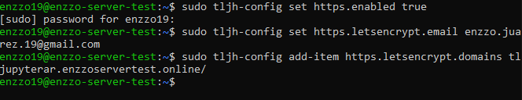

* Finalmente, puede volver a cargar el proxy para cargar la nueva configuración con el comando: 

   `$ sudo tljh-config reload proxy`

   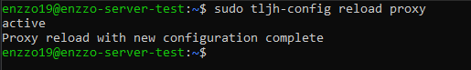

* En este punto, el proxy debe negociar con Let's Encrypt para configurar un certificado HTTPS de confianza para usted. El proxy puede tardar un momento en negociar con Let's Encrypt para obtener sus certificados, después de lo cual puede acceder a su Hub de forma segura en `<https://yourhub.yourdomain.edu>`.

* Estos certificados tienen una validez de 3 meses. El proxy los renovará automáticamente antes de que caduquen.

   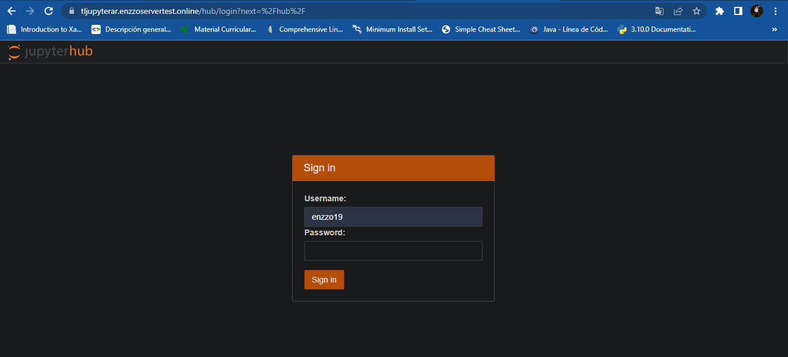

* Desde aqui como puedes ver nuestro Hub ya quedo apuntado a nuestro dominio y con los certificados de seguridad correspondientes. Solo debes iniciar sesion con el usuario que creaste unos pasos atras, y si es tu primera vez, la contraseña que coloques sera la que se guarde para ese usuario.

## 4. Customizar nuestro Hub

1. Instalar las NBExtensions

* Vamos a instalar una serie de herramientas/extensiones en nuestro Hub que daran soporte y mejoraran sin duda la practicidad del Hub para los usuarios. Estas seran las NB extensions de las cuales puedes encontrar documentacion [aqui](https://jupyter-contrib-nbextensions.readthedocs.io/en/latest/install.html)

* Y sobre como instalarlo en nuestro Hub podemos encontrar documentacion desde [aqui](https://tljh.jupyter.org/en/latest/howto/admin/enable-extensions.html)

* Una vez dentro de nuestro Hub en el navegador vamos a abrir una consola y correremos el comando:

   `$ sudo -E pip install jupyter_contrib_nbextensions`

* A continuación, agregue los archivos de estilo de la extensión del cuaderno a los archivos de configuración de Jupyter.

   `$ sudo -E jupyter contrib nbextension install --sys-prefix`

* Luego, habilitará las extensiones que le gustaría usar. La sintaxis para esto es seguida por la ruta al archivo principal de la extensión deseada. Por ejemplo, para habilitar el bloc de notas , escribiría lo siguiente: `jupyter nbextension enable`

   `$ sudo -E jupyter nbextension enable scratchpad/main --sys-prefix`

* Si quieres saber la utilidad de algunas de estas extensiones puedes buscarlas desde [aqui](https://jupyter-contrib-nbextensions.readthedocs.io/en/latest/nbextensions.html).

2. Compartir material con NBgitpuller

* Requisitos Previos:
  * Un JupyterHub configurado con The Littlest JupyterHub.
  * Un repositorio git que contiene materiales para distribuir.

    * Esto va a ser simplemente crear un repositorio en Github donde se encuentre todo el material que queremos distribuir en nuestra clase. Puedes ver como crear uno desde Github haciendo click [aqui](https://docs.github.com/es/get-started/quickstart/create-a-repo)
  
* Paso 1: Generar enlace nbgitpuller
  * La forma más rápida de generar un enlace es usar [nbgitpuller.link](https://jupyterhub.github.io/nbgitpuller/link.html), pero existen otras opciones como se describe en la documentación del proyecto [nbgitpuller](https://jupyterhub.github.io/nbgitpuller/use.html).

  * Personalmente recomiendo la forma rapida ya que es muy intuitiva y sencilla de usar.

* Desde la GUI de la herramienta nos pide:
  * El enlace donde esta apuntado nuestro Hub.
  * El enlace del repositorio donde esta el material a distribuir.

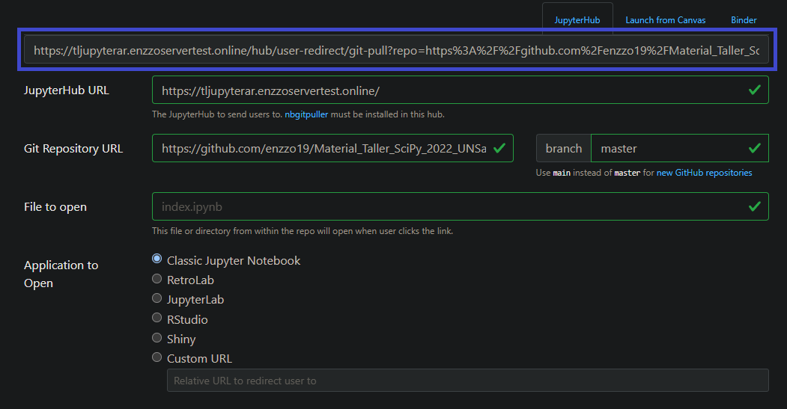

* Una vez cargado esto le podemos poner otros parametros como ser:
  * La carpeta que queremos que clone
  * La Rama del repositorio que queremos que clone
  * Y la aplicaion donde se abrira.

* Finalmente nos entrega como vemos en la imagen recuadrado de azul, un link para compartir a nuestros usuarios dentro del Hub.

* Paso 2: Los usuarios hacen clic en el enlace que nos genera `nbgitpuller`

* Envíe el enlace a sus usuarios de alguna manera: correo electrónico, slack, publique una versión abreviada (quizás con bit.ly) en la pared, o colóquelo en la página de su plan de estudios (como lo hace data8 de UC Berkeley ). Lo que funcione para ti :)

* Cuando los usuarios hagan clic en el enlace, se les pedirá que inicien sesión en el hub si aún no lo han hecho.

* Los usuarios verán una barra de progreso a medida que se recupera el repositorio de git y se realiza cualquier fusión automática requerida.

  

* Los usuarios ahora serán redirigidos al cuaderno especificado en la URL!

* Este flujo de trabajo permite a los usuarios llegar directamente al cuaderno que especificó sin tener que entender mucho sobre git o la interfaz de JupyterHub.

## 5. Desafio en el HUB

Link para el [DESAFIO](https://tljupyterar.enzzoservertest.online/hub/user-redirect/git-pull?repo=https%3A%2F%2Fgithub.com%2Fenzzo19%2FMaterial_Taller_SciPy_2022_UNSa&urlpath=tree%2FMaterial_Taller_SciPy_2022_UNSa%2F&branch=master)

## 6. Enlaces Utiles

* Guia de Instalacion: [aqui](https://jupyterhub.readthedocs.io/en/stable/installation-guide.html)

* Guia de Instalacion en tu propio servidor: [aqui](https://tljh.jupyter.org/en/latest/install/custom-server.html)

* Matar proceso en un puerto especifico: [aqui](https://www.enmimaquinafunciona.com/pregunta/86326/linux-matar-proceso-en-un-puerto-especifico)

* Configurar Firewall: [aqui](https://computernewage.com/2014/08/10/como-configurar-el-firewall-ufw-en-ubuntu/)

* Conocer la ip de tu servidor: `$ curl ifconfig.me/all`

* Añadir a URL to run HupyterHub por https: [aqui](https://tljh.jupyter.org/en/latest/howto/admin/https.html#howto-admin-https)

* Si no carga en web [aqui](https://github.com/jupyterhub/the-littlest-jupyterhub/issues/438)

* Habilitar las extensiones: [aqui](https://tljh.jupyter.org/en/latest/howto/admin/enable-extensions.html)

* Customizar el tema en jupyter notebooks: [aqui](https://towardsdatascience.com/customize-your-jupyter-notebook-theme-in-2-lines-of-code-fc726cea1513#:~:text=By%20default%2C%20Jupyter%20Notebook%20uses,the%20theme%20of%20the%20notebook).

* Compartir archivos para todos los usuarios: [aqui](https://jupyterhub.github.io/nbgitpuller/link)

* Extension para Chrome de nbgitpuller: [aqui](https://github.com/yuvipanda/nbgitpuller-link-generator-webextension#on-google-chrome--chromium)

## Contactos

* Grupo en Telegram de [Python Norte](https://t.me/pythonnorte)

* Grupo en Telegram de [Python Cientifico Latinoamericano](https://t.me/scipyla)

* Mi correo [enzzo.juarez.19@gmail.com](enzzo.juarez.19@gmail.com)

* Si tienes cualquier duda o alguna sugerencia que suelen ser muy utiles puedes enviarme un mensaje a mi o en la comunidad para que podamos seguir haciendo crecer esto.
